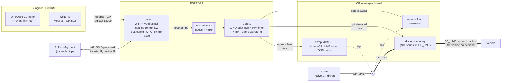
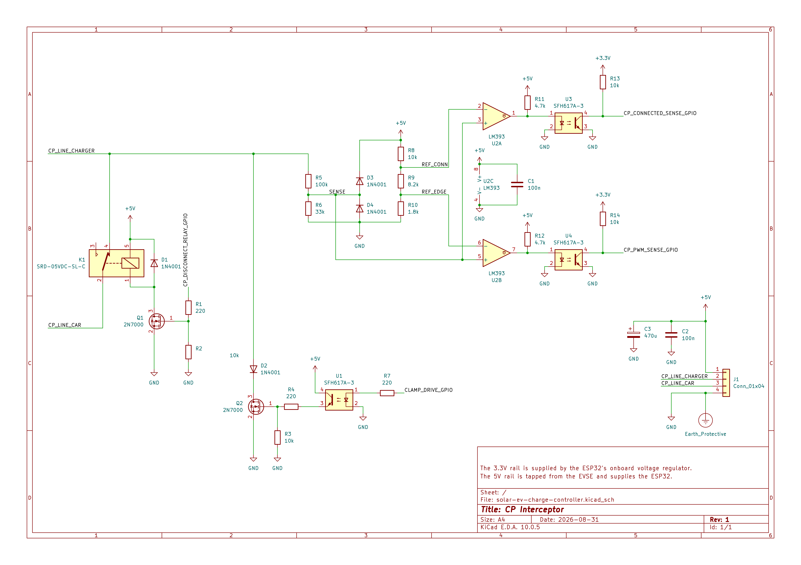
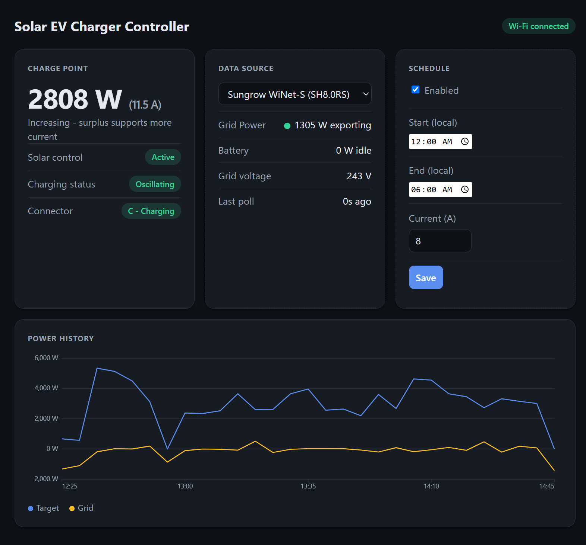
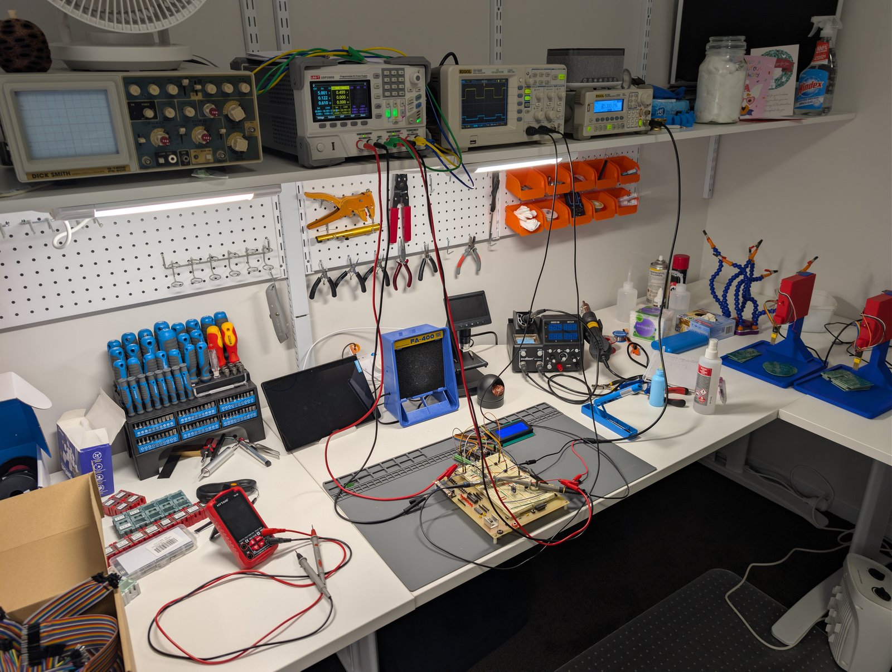
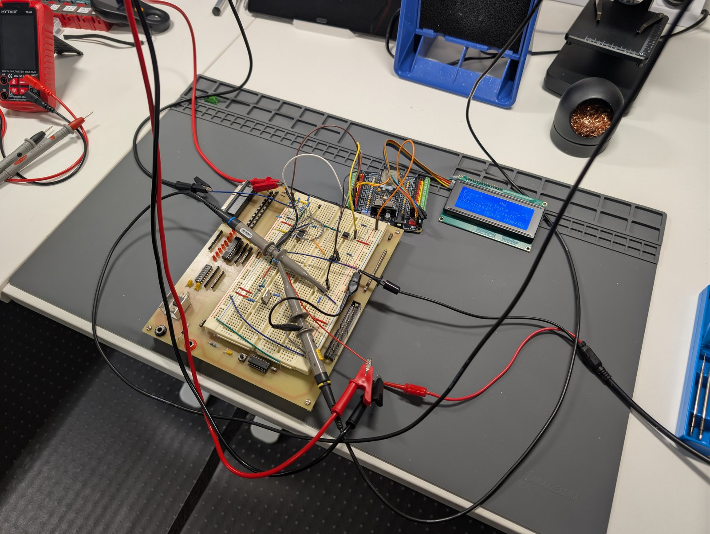
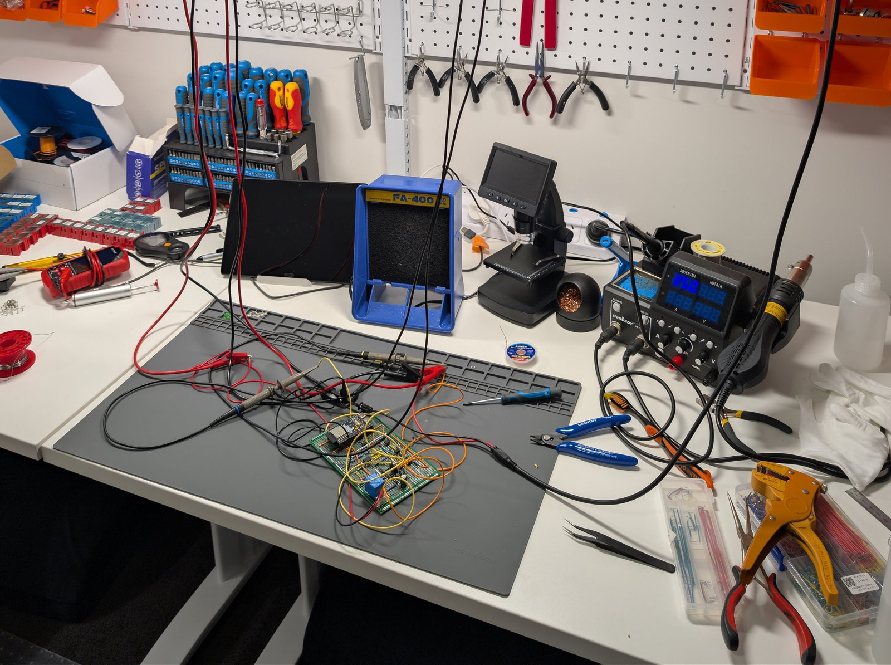
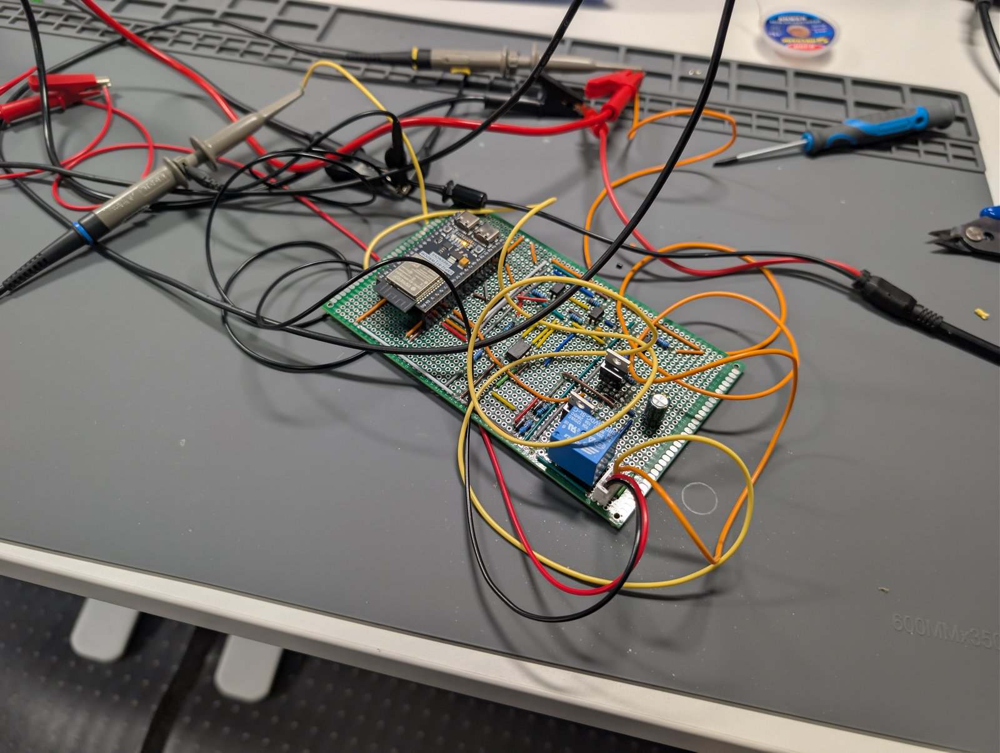
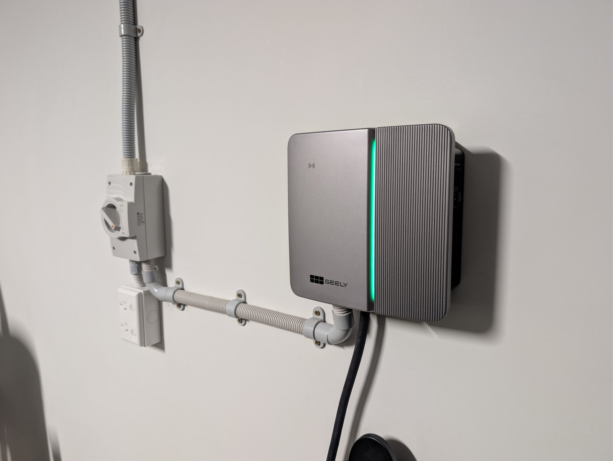
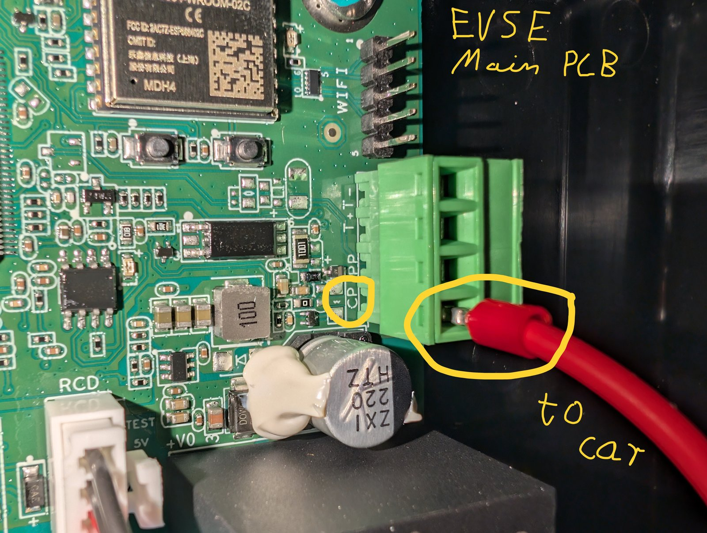

# Solar EV Charge Controller

Diverts surplus rooftop solar into EV charging by dynamically limiting the charge current a "dumb" (non-networked) EVSE offers to the car, based on real-time export data from a Sungrow hybrid inverter. The EVSE has no API or Modbus control path, so the only lever available is intercepting its Control Pilot (CP) signal to the car and clipping the duty cycle down when there isn't enough solar surplus to support the current it would otherwise offer.

> **⚠️ Safety & Disclaimer**
> This project modifies wiring in a vehicle charging circuit, adjacent to mains-connected equipment. Incorrect wiring or assembly can cause electric shock, fire, or damage to your vehicle or EVSE. It is not a certified product, has not been evaluated by any safety body, and may void your EVSE's warranty. Build and use it entirely at your own risk — see the [Safety model](#safety-model) section below for the fail-safe design rationale, and the [LICENSE](LICENSE) for the "AS IS" warranty disclaimer.

For full pin assignments, register maps, timing/ISR design detail, and the fail-safe rationale, see [CLAUDE.md](CLAUDE.md).

## How it works

A single ESP32-S3 splits the job across its two cores: Core 0 polls the inverter over WiFi and decides how many amps the surplus can support; Core 1 runs the real-time loop that actually shapes the CP waveform between the charger and the car. The two talk over a small queue/mutex bridge — Core 1 never blocks on anything Core 0-side.



Key properties baked into the topology, not just firmware:
- **`CP_LINE` runs straight through from the EVSE to the vehicle connector, only ever interrupted by the disconnect relay.** The interceptor board taps onto it at one point (upstream of the relay) to sense it and, when needed, shunt it low — the sense/clamp tap is never wired inline, so removing or failing the board there can't interrupt the wire itself. The relay is the one deliberate exception: it's wired inline, in series, specifically so it *can* interrupt the wire — see [Safety model](#safety-model) for why that's still fail-safe.
- The clamp can only **shunt `CP_LINE` toward `GND`** — it has no way to source voltage, so it can clip current down but can never raise it above what the EVSE natively offers, regardless of what firmware does.
- The relay only ever **removes the vehicle's CP termination**, never alters the waveform — with it open, the EVSE sees the same thing it would see on a real unplug (state A) and stops offering charge using its own normal handling, not a signal this project invents.
- Isolation is **signal-only**: the sense/clamp/relay lines that cross into/out of Core 1 each go through their own optocoupler, but the sense/clamp/relay circuitry itself shares a ground with the ESP32 side (no separate PE-referenced supply). See [CP interceptor circuit](#cp-interceptor-circuit) below.
- **Home-battery discharge doesn't count as surplus.** The meter sits downstream of the home battery, so it can't tell fresh PV export apart from battery-discharge export on its own — Core 0 reads the inverter's battery-power register separately and subtracts any discharge back out before computing how much current the surplus can support, so the loop never diverts battery power into EV charging.

See [Safety model](#safety-model) below for the full fail-safe contract.

## CP interceptor circuit



KiCad source: [`schematic/solar-ev-charge-controller/`](schematic/solar-ev-charge-controller/).

`CP_LINE` feeds a high-Z divider (`R5`/`R6`) down to a `SENSE` node, read by a dual comparator (`U2`, LM393) against two fixed reference taps — one output detects vehicle-connected state (`CONNECTED_IN`), the other detects PWM edge activity (`EDGE_IN`). Each comparator output, plus the clamp drive command going the other way, crosses into the ESP32's domain through its own optocoupler (`U3`/`U4`/`U1` respectively) — that's the only isolation boundary; the sense/comparator/clamp circuitry otherwise shares `GND`/`+5V` with the ESP32 side. The clamp itself is a MOSFET (`Q2`, 2N7000) that taps onto `CP_LINE` through a series blocking diode (`D2`) and shunts it toward `GND` when driven; its gate defaults low via a pull-down resistor (`R3`) whenever nothing is actively driving it.

Further downstream (toward the vehicle) of the `R5`/`D2` tap sits a normally-closed disconnect relay (`K1`), wired in series on `CP_LINE` itself rather than tapped off it — the one deliberate break in an otherwise continuous wire. Its coil is driven through its own optocoupler and a low-side driver transistor (`Q1`), with a flyback diode (`D1`) across the coil. De-energized (the default whenever nothing is actively driving it) the contact stays closed and `CP_LINE` passes straight through; energizing it opens the contact and isolates the vehicle's CP termination from everything upstream, which the EVSE reads as a real unplug.

**Reference designators were renumbered by a KiCad annotation pass; the table below reflects the current schematic, wire-traced pin-by-pin to confirm.**

| Ref | Part | Note |
|---|---|---|
| `R5` / `R6` | 100kΩ / 33kΩ | `CP_LINE` → `SENSE` divider |
| `D3` / `D4` | 1N4001 | `SENSE` overvoltage clamp to `+5V` / `GND` |
| `R8` / `R9` / `R10` | 10k / 8.2k / 1.8k | reference ladder off `+5V` (REF_CONN ≈2.5V, REF_EDGE ≈0.45V) |
| `U2` | LM393 | dual comparator — unit 1 → `CONNECTED_IN` chain, unit 2 → `EDGE_IN` chain |
| `R11` / `R12` | 4.7kΩ | comparator unit 1/2 output pull-up to `+5V`, doubles as opto LED drive |
| `U3` / `U4` | SFH617A-3 | `CONNECTED_IN` / `EDGE_IN` optocouplers |
| `R13` / `R14` | 10kΩ | `CONNECTED_IN` / `EDGE_IN` pull-up to `+3.3V` (opto secondary) |
| `R7` | 220Ω | `CLAMP_DRIVE` opto (`U1`) LED current limit |
| `U1` | SFH617A-3 | `CLAMP_DRIVE` optocoupler |
| `R4` | 220Ω | opto secondary → `Q2` gate series resistor |
| `R3` | 10kΩ | `Q2` gate pull-down (default off) |
| `Q2` | 2N7000 | clamp MOSFET |
| `D2` | 1N4001 | series blocking diode, `CP_LINE` → `Q2` |
| `K1` | 5V SPDT signal relay (NC contact used) | disconnect relay, in series on `CP_LINE` downstream of the `R5`/`D2` tap |
| `Q1` | 2N7000 | `K1` coil low-side driver transistor |
| `D1` | 1N4001 | `K1` coil flyback diode |

Values are a starting point, not final — see [CLAUDE.md § CP interception circuit](CLAUDE.md#cp-interception-circuit) for the full rationale and [§ Open questions](CLAUDE.md#open-questions-for-implementation) for what's still unverified on the bench.

## Hardware

Freenove ESP32-S3-WROOM on its breakout board. Dual-core split:

| Core | Role |
|---|---|
| Core 0 | WiFi, Modbus TCP polling of the inverter, control law, BLE config server, OTA, control page |
| Core 1 (pinned, high priority) | GPIO edge-triggered ISR + hardware timer + RMT — asserts/releases the CP clamp with sub-task-switch latency |

Pin assignments live in [`include/config.h`](include/config.h) (see CLAUDE.md for the full table and rationale) — physically confirmed on the bench.

## Firmware layout

| File | Responsibility |
|---|---|
| [`src/main.cpp`](src/main.cpp) | Task/core setup |
| [`src/solar_control.*`](src/solar_control.cpp) | Core 0: WiFi, poll loop, settling control law, OTA, control page |
| [`src/modbus_tcp_client.*`](src/modbus_tcp_client.cpp) | Minimal hand-rolled Modbus TCP client for the WiNet-S |
| [`src/cp_interceptor.*`](src/cp_interceptor.cpp) | Core 1: edge capture, RMT clamp waveform, `BYPASS`/`ACTIVE` × `OSCILLATING`/`STANDBY` state machine, watchdog |
| [`src/shared_state.*`](src/shared_state.cpp) | Core0↔Core1 bridge (queue + mutex, zero-timeout on Core 1's side); also holds the BLE-provisioned WiFi/inverter-IP `RuntimeConfig` |
| [`src/ble_config.*`](src/ble_config.cpp) | Core 0: BLE server for provisioning WiFi SSID/password, inverter IP, and the BLE-config/control-page passwords, and reading back the device's current IP |
| [`include/config.h`](include/config.h) | Pins, control-loop constants, thresholds |
| [`include/secrets.h`](include/secrets.h) (gitignored) | `OTA_PASSWORD` only, used solely for OTA flashing — auto-generated from `.env` before every build, see below |

## Building & flashing

PlatformIO project, environment `freenove_esp32_s3_wroom`, framework Arduino.

```sh
cp .env.example .env   # then edit with a real OTA password
pio run                # build - regenerates include/secrets.h from .env first
pio run -t upload      # flash over USB
```

`include/secrets.h` is auto-generated from `OTA_PASSWORD` in `.env` by [`tools/sync_secrets.py`](tools/sync_secrets.py) (wired in as a PlatformIO pre-build step, so it runs for any env, any invocation path, including the VSCode PlatformIO IDE buttons) — don't edit it by hand, edit `.env` instead. WiFi SSID/password, the inverter IP, and the BLE-config/control-page passwords have no compile-time fallback — `OTA_PASSWORD` is used solely for OTA flashing. Everything else is provisioned over Bluetooth Low Energy after first flash. Connect with any BLE serial-terminal app (Serial Bluetooth Terminal, nRF Connect's UART plugin, etc.) — it auto-detects the device as a Nordic UART Service and drops straight into terminal mode — then send `AUTH <anything>` (open until a `BLE_PASS` is set), `SET WIFI_SSID <ssid>`, `SET WIFI_PASS <password>`, `SET INVERTER_IP <inverter ip>`, `COMMIT`, `SET BLE_PASS <password>` (required for `AUTH` on future connections), and `SET WEB_PASS <password>` (required before the HTTP control page below will respond to anything but a 403) — send `HELP` any time for the full command list. See [CLAUDE.md § BLE configuration](CLAUDE.md#ble-configuration) for the full protocol.

BLE advertises **indefinitely** until the device has been provisioned at least once, so a freshly-flashed board is always reachable — after that first `COMMIT`, it only advertises for `BLE_ADVERTISE_WINDOW_MS` (5 minutes, [`include/config.h`](include/config.h)) after each boot, closing the window for the rest of that session. To reconfigure a device that's already provisioned, power-cycle it and connect within that 5-minute window.

Once WiFi is up, subsequent flashes can go over OTA (`ArduinoOTA`, password-protected by `OTA_PASSWORD`) instead of pulling the board for USB access. Run it with `python tools/ota_upload.py` (loads `.env`'s `UPLOAD_PORT`/`OTA_PASSWORD` for that one invocation), or run `python tools/sync_env_vars.py` once and restart VSCode to make the PlatformIO IDE's own "Upload" button work directly with the `ota` environment selected — see the `[env:ota]` comment in [`platformio.ini`](platformio.ini) for why `.env` can't be wired in more automatically than that. The control page at `http://<device-ip>/` (HTTP Basic Auth, username `admin`, password set over BLE via `SET WEB_PASS` — refuses all requests until one has been set) is the same page used for live operation, with a grid-source dropdown to switch between the real inverter and a family of reactive simulated scenarios (no sun / low / moderate / high / battery-discharge) — the latter exercise the full poll/control-law/target-amps path for bench and night-time testing without real solar.

## Safety model

- **Inherent (topology-level):** no drive on `CLAMP_DRIVE` (idle, unpowered, firmware not yet running) → a pull-down resistor holds the clamp MOSFET's gate low → native pass-through, unconditionally. Clamp stuck on/shorted → CP read as a fault/disconnect by the EVSE → charging stops, doesn't misbehave. The clamp can never drive current *above* native regardless of firmware state, since it can only shunt the line toward `GND`, never source voltage onto it. The disconnect relay (`K1`) follows the same direction: no drive on its coil → normally-closed contact stays closed → `CP_LINE` passes through unconditionally. Losing the ESP32 must never leave the vehicle unable to charge at all.
- **Explicit (firmware-level):** if Core 0 can't get a fresh inverter reading for ~60s, Core 1 switches to `MODE_BYPASS`, stops scheduling clamp assertions, and keeps the disconnect relay closed regardless of duty state — same end state as a power loss. A data fault is never treated as a confident "no surplus" decision, so it never triggers a disconnect. A hardware watchdog on the CP task forces a reboot rather than letting a hang freeze the waveform mid-cycle.
- **When surplus is genuinely below the 6A floor** (fresh data, not a fault): Core 1 opens `K1`, isolating the vehicle's CP termination so the EVSE reads a real unplug and stops charging via its own handling — this *is* a relay-backed physical disconnect, and deliberately replaced an earlier version that instead released the clamp to full native current at exactly the moment surplus was lowest. See [CLAUDE.md § CP interception circuit](CLAUDE.md#cp-interception-circuit) for the full rationale.

## Status

Bench-tested through all stages, including the real EVSE and a real vehicle (2026-09-04): BLE provisioning, comparator thresholds, disconnect-relay open/close, and live mid-charge duty-cycle changes all confirmed clean. All previously open items are now resolved — see [CLAUDE.md § Open questions](CLAUDE.md#open-questions-for-implementation).

## Gallery

Control page:

<p align="center"></p>

Bench setup:

| | |
|---|---|
|  |  |
|  |  |

EVSE enclosure:

| | |
|---|---|
|  |  |

## Author

[coder@niftyforger.com](mailto:coder@niftyforger.com)

Need a better way to organize your inventory, assemblies and projects? Try [niftyforger.com](https://niftyforger.com)