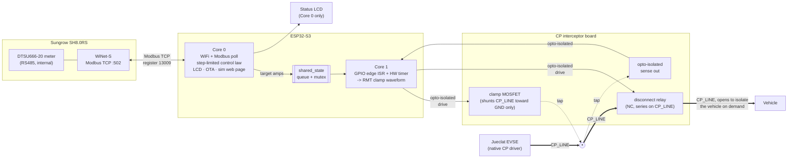

# geely-charger-controller

Diverts surplus rooftop solar into EV charging by dynamically limiting the charge current a "dumb" (non-networked) EVSE offers to the car, based on real-time export data from a Sungrow hybrid inverter. The EVSE (a Jueclat EV Charger-Lite) has no API or Modbus control path, so the only lever available is intercepting its Control Pilot (CP) signal to the car and clipping the duty cycle down when there isn't enough solar surplus to support the current it would otherwise offer.

For full pin assignments, register maps, timing/ISR design detail, and the fail-safe rationale, see [CLAUDE.md](CLAUDE.md).

## How it works

A single ESP32-S3 splits the job across its two cores: Core 0 polls the inverter over WiFi and decides how many amps the surplus can support; Core 1 runs the real-time loop that actually shapes the CP waveform between the charger and the car. The two talk over a small queue/mutex bridge — Core 1 never blocks on anything Core 0-side.



Key properties baked into the topology, not just firmware:
- **`CP_LINE` runs straight through from the Jueclat to the vehicle connector, only ever interrupted by the disconnect relay.** The interceptor board taps onto it at one point (upstream of the relay) to sense it and, when needed, shunt it low — the sense/clamp tap is never wired inline, so removing or failing the board there can't interrupt the wire itself. The relay is the one deliberate exception: it's wired inline, in series, specifically so it *can* interrupt the wire — see [Safety model](#safety-model) for why that's still fail-safe.
- The clamp can only **shunt `CP_LINE` toward `GND`** — it has no way to source voltage, so it can clip current down but can never raise it above what the Jueclat natively offers, regardless of what firmware does.
- The relay only ever **removes the vehicle's CP termination**, never alters the waveform — with it open, the Jueclat sees the same thing it would see on a real unplug (state A) and stops offering charge using its own normal handling, not a signal this project invents.
- Isolation is **signal-only**: the sense/clamp/relay lines that cross into/out of Core 1 each go through their own optocoupler, but the sense/clamp/relay circuitry itself shares a ground with the ESP32 side (no separate PE-referenced supply). See [CP interceptor circuit](#cp-interceptor-circuit) below.

See [Safety model](#safety-model) below for the full fail-safe contract.

## CP interceptor circuit


KiCad source: [`schematic/CCS2_charge_limiter/`](schematic/CCS2_charge_limiter/).

`CP_LINE` feeds a high-Z divider (`R1`/`R2`) down to a `SENSE` node, read by a dual comparator (`U1`, LM393) against two fixed reference taps — one output detects vehicle-connected state (`CONNECTED_IN`), the other detects PWM edge activity (`EDGE_IN`). Each comparator output, plus the clamp drive command going the other way, crosses into the ESP32's domain through its own optocoupler (`U2`/`U3`/`U4`) — that's the only isolation boundary; the sense/comparator/clamp circuitry otherwise shares `GND`/`+5V` with the ESP32 side. The clamp itself is a MOSFET (`Q2`, AO3400) that taps onto `CP_LINE` through a series blocking diode (`D3`) and shunts it toward `GND` when driven; its gate defaults low via a pull-down resistor (`R10`) whenever nothing is actively driving it.

Further downstream (toward the vehicle) of the `R1`/`D3` tap sits a normally-closed disconnect relay (`K1`), wired in series on `CP_LINE` itself rather than tapped off it — the one deliberate break in an otherwise continuous wire. Its coil is driven through its own optocoupler and a low-side driver transistor, with a flyback diode across the coil. De-energized (the default whenever nothing is actively driving it) the contact stays closed and `CP_LINE` passes straight through; energizing it opens the contact and isolates the vehicle's CP termination from everything upstream, which the Jueclat reads as a real unplug.

| Ref | Part | Note |
|---|---|---|
| `R1` / `R2` | 100kΩ / 33kΩ | `CP_LINE` → `SENSE` divider |
| `D1` / `D2` | 1N4001 | `SENSE` overvoltage clamp to `+5V` / `GND` |
| `R3` / `R4` / `R5` | 10k / 8.2k / 1.8k | reference ladder off `+5V` (REF_EDGE ≈0.45V, REF_CONN ≈2.5V) |
| `U1` | LM393 | dual comparator — `U1A` → `EDGE_IN`, `U1B` → `CONNECTED_IN` |
| `R6` / `R7` | 4.7kΩ | comparator output pull-up, doubles as opto LED current limit |
| `U2` / `U3` | SFH617A-3 | `EDGE_IN` / `CONNECTED_IN` optocouplers |
| `R8` / `R9` | 10kΩ | `EDGE_IN` / `CONNECTED_IN` pull-up to `+3.3V` (opto secondary) |
| `R14` | 220Ω | `CLAMP_DRIVE` opto LED current limit |
| `U4` | SFH617A-3 | `CLAMP_DRIVE` optocoupler |
| `R13` | 220Ω | opto secondary → `Q2` gate series resistor |
| `R10` | 10kΩ | `Q2` gate pull-down (default off) |
| `Q2` | AO3400 | clamp MOSFET |
| `D3` | 1N4148 | series blocking diode, `CP_LINE` → `Q2` drain |
| `R12` | 220Ω | `Q2` source → `GND`, clamp current limit |
| `K1` | 5V SPDT signal relay (NC contact used) | disconnect relay, in series on `CP_LINE` downstream of the `R1`/`D3` tap |
| — | opto + driver transistor + flyback diode | `K1` coil drive, isolated the same way as `U2`/`U3`/`U4` |

Values are a starting point, not final — see [CLAUDE.md § CP interception circuit](CLAUDE.md#cp-interception-circuit) for the full rationale and [§ Open questions](CLAUDE.md#open-questions-for-implementation) for what's still unverified on the bench.

## Hardware

Freenove ESP32-S3-WROOM on its breakout board. Dual-core split:

| Core | Role |
|---|---|
| Core 0 | WiFi, Modbus TCP polling of the inverter, control law, status LCD, OTA, sim-mode web page |
| Core 1 (pinned, high priority) | GPIO edge-triggered ISR + hardware timer + RMT — asserts/releases the CP clamp with sub-task-switch latency |

Pin assignments live in [`include/config.h`](include/config.h) (see CLAUDE.md for the full table and rationale) — not yet physically confirmed on the bench.

## Firmware layout

| File | Responsibility |
|---|---|
| [`src/main.cpp`](src/main.cpp) | Task/core setup |
| [`src/solar_control.*`](src/solar_control.cpp) | Core 0: WiFi, poll loop, step-limited/settling control law, OTA, sim-mode page |
| [`src/modbus_tcp_client.*`](src/modbus_tcp_client.cpp) | Minimal hand-rolled Modbus TCP client for the WiNet-S |
| [`src/cp_interceptor.*`](src/cp_interceptor.cpp) | Core 1: edge capture, RMT clamp waveform, `BYPASS`/`ACTIVE` × `OSCILLATING`/`STANDBY` state machine, watchdog |
| [`src/shared_state.*`](src/shared_state.cpp) | Core0↔Core1 bridge (queue + mutex, zero-timeout on Core 1's side) |
| [`src/status_display.*`](src/status_display.cpp) | Core 0: LCD refresh, own task so a stuck I2C bus can't touch control |
| [`include/config.h`](include/config.h) | Pins, control-loop constants, thresholds |
| [`include/secrets.h`](include/secrets.h) (gitignored) | WiFi credentials, inverter IP, OTA/control-page password — copy from [`include/secrets.example.h`](include/secrets.example.h) before flashing |

## Building & flashing

PlatformIO project, environment `freenove_esp32_s3_wroom`, framework Arduino.

```sh
cp include/secrets.example.h include/secrets.h   # then edit with real credentials
pio run                                          # build
pio run -t upload                                # flash over USB
```

Once WiFi is up, subsequent flashes can go over OTA (`ArduinoOTA`, password-protected) instead of pulling the board for USB access. A sim-mode web page at `http://<device-ip>/` (same password, HTTP Basic Auth) lets you drive the control loop with a fake export figure for bench/night-time testing without real solar.

## Safety model

- **Inherent (topology-level):** no drive on `CLAMP_DRIVE` (idle, unpowered, firmware not yet running) → a pull-down resistor holds the clamp MOSFET's gate low → native pass-through, unconditionally. Clamp stuck on/shorted → CP read as a fault/disconnect by the Jueclat → charging stops, doesn't misbehave. The clamp can never drive current *above* native regardless of firmware state, since it can only shunt the line toward `GND`, never source voltage onto it. The disconnect relay (`K1`) follows the same direction: no drive on its coil → normally-closed contact stays closed → `CP_LINE` passes through unconditionally. Losing the ESP32 must never leave the vehicle unable to charge at all.
- **Explicit (firmware-level):** if Core 0 can't get a fresh inverter reading for ~60s, Core 1 switches to `MODE_BYPASS`, stops scheduling clamp assertions, and keeps the disconnect relay closed regardless of duty state — same end state as a power loss. A data fault is never treated as a confident "no surplus" decision, so it never triggers a disconnect. A hardware watchdog on the CP task forces a reboot rather than letting a hang freeze the waveform mid-cycle.
- **When surplus is genuinely below the 6A floor** (fresh data, not a fault): Core 1 opens `K1`, isolating the vehicle's CP termination so the Jueclat reads a real unplug and stops charging via its own handling — this *is* a relay-backed physical disconnect, and deliberately replaced an earlier version that instead released the clamp to full native current at exactly the moment surplus was lowest. See [CLAUDE.md § CP interception circuit](CLAUDE.md#cp-interception-circuit) for the full rationale, and [§ Open questions](CLAUDE.md#open-questions-for-implementation) for what's still unverified about how gracefully the Jueclat/vehicle recover from it.

## Status

Not yet bench-validated. Bring-up proceeds in three stages — bench CP simulator only, then real Jueclat + CP simulator, then real Jueclat + real vehicle under supervision — before anything runs unattended. See [CLAUDE.md § Bench testing & validation plan](CLAUDE.md#bench-testing--validation-plan) for details and [§ Open questions](CLAUDE.md#open-questions-for-implementation) for what's still unresolved.
